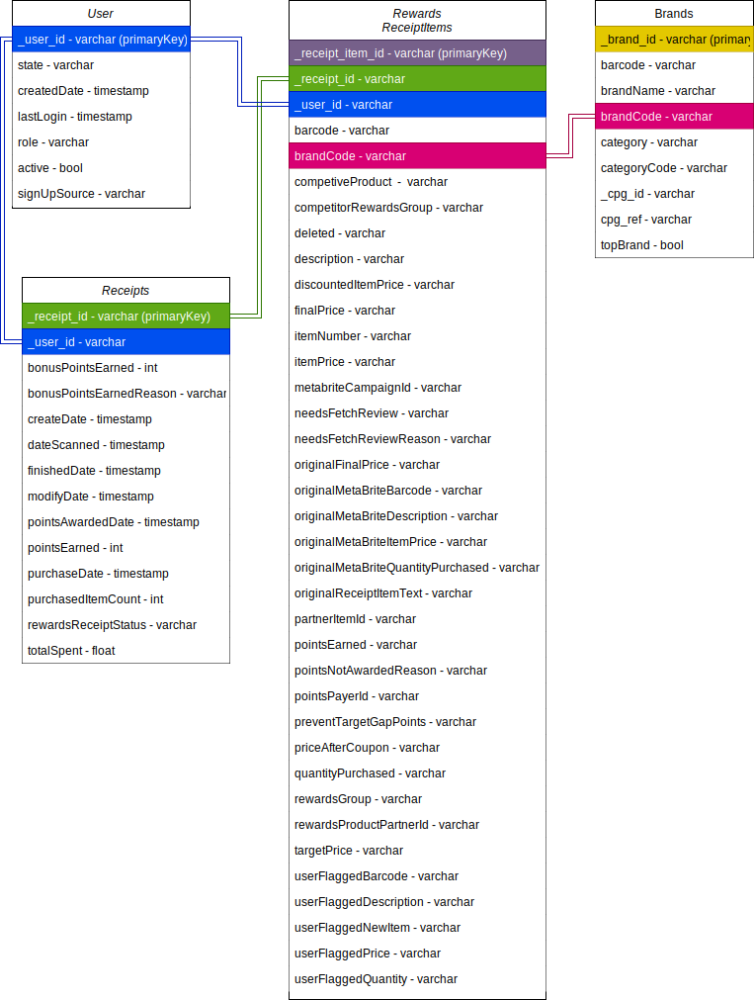

# Fetch - AE Coding Exercise

## Background

For this assessment I am loading the unstructured JSON data into a locally run DuckDB in a Python 3.11.5 environment. DuckDB uses the **PostgresSQL dialect** with some additonal functions - most notably `read_json_auto()` which is not native to PostgresSQL (See `load_raw()` in [src/database.py](src/database.py)).

## [1] Review existing unstructured data and diagram a new structured relational data model

- Investigated nested JSON's in receipt, brand, and user JSON's to prepare to flatten unstructured data model for new data model. See [notebooks/shape.ipynb](notebooks/shape.ipynb)
  - Brands - Contains key `cpg` which is nested containing keys `$id` and `$ref`
  - Receipts - Contains key `rewardsReceiptItemList` which contains 34 hidden keys
    - Most notable of the 34 are `brandCode`, `barcode`, `finalPrice`, `itemPrice`, and `userFlaggedPrice`
- Diagrammed basic relational data model
  - Possible improvements after completing the assessment
  - After review of the 34 distinct keys in `rewardsReceiptItemList`, we may be able to split out specific pieces to their own tables. i.e any MetaBrite fields may be pulled out into a Metabrite table.
  - Attach `dateScanned`, `purchasedDate`, and `pointsAwardedDate` to the RewardsReceiptItems table for easier querying.
    

## [2] Write queries that directly answer predetermined questions from a business stakeholder

See [notebooks/q2.ipynb](notebooks/q2.ipynb)

- **What are the top 5 brands by receipts scanned for most recent month?**
  - In March 2021, there are no receipts or receipt items with brand codes associated with them.
- **How does the ranking of the top 5 brands by receipts scanned for the recent month compare to the ranking for the previous month?**
  - Comparing March 2021 to February 2021, we can see we now have brand information for some receipts/receipt items.
- **When considering average spend from receipts with 'rewardsReceiptStatus’ of ‘Accepted’ or ‘Rejected’, which is greater?**
  - The average spend is higher for 'Accepted' (aka FINISHED) receipts.
- **When considering total number of items purchased from receipts with 'rewardsReceiptStatus’ of ‘Accepted’ or ‘Rejected’, which is greater?**
  - The total number of items purchased is higher for 'Accepted' (aka FINISHED) receipts.
- **Which brand has the most spend among users who were created within the past 6 months?**
  - Anchoring in 2025, no brands have any spend among users created within the past 6 months
  - Anchoring as of March 2021, Ben and Jerry's has the most spend among users created between 2020-09-01 and 2021-03-01.
- **Which brand has the most transactions among users who were created within the past 6 months?**
  - Brand code 'BRAND' has the most transactions among users created within the past 6 months

## [3] Evaluate Data Quality Issues in the Data Provided

See [notebooks/q3.ipynb](notebooks/q3.ipynb)

- Added notes on data quality findings from the process of answering [2].
- Investigated Data Quality when answering **[2] 'What are the top 5 brands by receipts scanned for most recent month?'** and **'How does the ranking of the top 5 brands by receipts scanned for the recent month compare to the ranking for the previous month?'**
  - Is the question really about March and February 2021?
    - Maybe we should be talking about February and January 2021 insteade.
  - Many brand codes are missing from receipt items - are we able to merge brand codes from elsewhere?
    - Yes - maybe

## [4] Communicate with Stakeholders

Hey [name],

I just completed the first version of our data model for the customer receipts, brands, and rewards items information. **When going through the receipts data** I noticed not all the items in the list of rewards receipt items have associated brand codes, barcodes, item prices, or user flagged prices. **I'm wondering how these 4 fields are populated.**

I attempted to join the brand codes from the brands table using barcodes but, it seems the barcodes in the brands table follow a 12 digit format while the barcodes in the receipt information doesn't seem to follow any standard format. **Is this by design - are receipt barcodes inherently different from brand barcodes? Is there a barcodes table?**

- Some example barcodes in receipts: B076FJ92M4, 4011, 028400642255.

If the barcodes are not inherently different and the brands table just needs more values for other barcodes. **Is there a way to integrate this so brand codes and barcodes are always or never in the receipts item information?** I'm also worried merging on barcodes from the brands table may pose an issue in the future as the brands table should be unique to a brand and the amount of distinct barcodes scanned may be overwhelming as new products get added to the rewards list.

Let me know if I need to clarify on anything, I'm happy to jump on a call too.

Best,

Danah Dykstra
